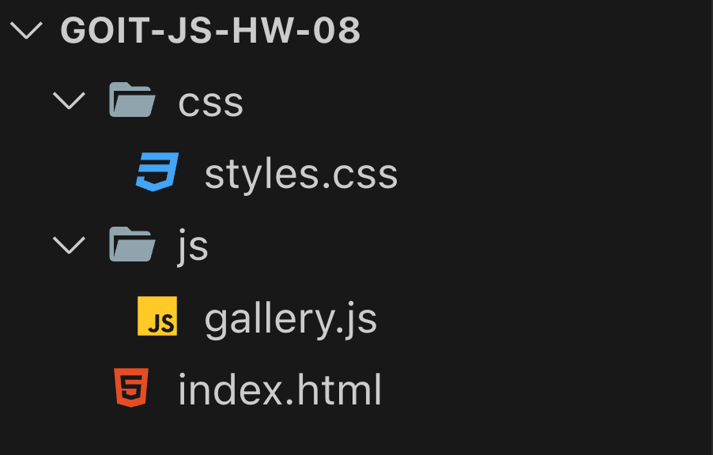

<!-- @format -->

# goit-js-hw-08

## Призначення проекту

Створити галерею з можливістю кліку по її елементах і перегляду повнорозмірного зображення в модальному вікні.  або [тут](https://goitlmsstorage.b-cdn.net/baa63960-09b4-4a6e-9f8a-c4a9276e0e76IMG_2064.MP4) роботи галереї.

<iframe width="560" height="315" src="https://www.youtube.com/embed/dQw4w9WgXcQ" frameborder="0" allow="accelerometer; autoplay; encrypted-media; gyroscope; picture-in-picture" allowfull

## Структура проекту

Структура вкладеності вказана на  або [тут](https://s3.eu-north-1.amazonaws.com/lms.goit.files/707badf5-368a-42fc-82f2-b156ede5dfe28.png).

## Бібліотека та Сервіси

- Бібліотека [basicLightbox](https://github.com/electerious/basicLightbox/tree/master).
- Сервіс [CDN сервіс jsdelivr](https://www.jsdelivr.com/package/npm/basiclightbox?path=dist).

## Форматування

- Prettier

## Валідація

- [validator.w3](http://validator.w3.org/nu/).
